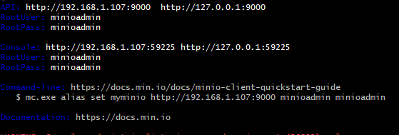

# java-course-day2

Kod från dag 2 i "Utveckling i modern Java"


#### Tider:
8.30-16.30 med en timmes lunch. Dagen delas upp efter kursdeltagarnas önskemål.


### Kursmaterial
Kursmaterialet för denna dagen består av detta git-repo och inspelningar från Teams-mötet. Se nedan för länkar:     

[8.30-10.30](https://combitechcloud-my.sharepoint.com/personal/martin_frisk_combitech_com/_layouts/15/onedrive.aspx?id=%2Fpersonal%2Fmartin%5Ffrisk%5Fcombitech%5Fcom%2FDocuments%2FRecordings%2FDag%202%20Java%2Dkurs%2D20220505%5F083830%2DM%C3%B6tesinspelning%2Emp4&parent=%2Fpersonal%2Fmartin%5Ffrisk%5Fcombitech%5Fcom%2FDocuments%2FRecordings&ga=1) 
- Introduktion till dropwizard, JAX-RS och Jackson. Skapade en första Hello World-resurs

[11.10-12.00](https://combitechcloud-my.sharepoint.com/personal/martin_frisk_combitech_com/_layouts/15/onedrive.aspx?id=%2Fpersonal%2Fmartin%5Ffrisk%5Fcombitech%5Fcom%2FDocuments%2FRecordings%2FDag%202%20Java%2Dkurs%2D20220505%5F111149%2DM%C3%B6tesinspelning%2Emp4&parent=%2Fpersonal%2Fmartin%5Ffrisk%5Fcombitech%5Fcom%2FDocuments%2FRecordings&ga=1)
- Installerade MinIO-server och Postman. Lade till config för Minio och skapade upp en ImagesResource.

[13.00-13.40](https://combitechcloud-my.sharepoint.com/personal/martin_frisk_combitech_com/_layouts/15/onedrive.aspx?id=%2Fpersonal%2Fmartin%5Ffrisk%5Fcombitech%5Fcom%2FDocuments%2FRecordings%2FDag%202%20Java%2Dkurs%2D20220505%5F130106%2DM%C3%B6tesinspelning%2Emp4&parent=%2Fpersonal%2Fmartin%5Ffrisk%5Fcombitech%5Fcom%2FDocuments%2FRecordings&ga=1)   
- Lade till implementation för att ladda upp och hämta en bild.


### Dagens innehåll

Målet med dagen är att bygga en liten mikrotjänst för att spara bilder med hjälp av Dropwizard (https://www.dropwizard.io/en/latest/) 
och MinIO (https://docs.min.io/docs/minio-quickstart-guide.html, en object storage vars API är kompatibelt med Amazon S3 storage.)

Dropwizard är något mellanting mellan ett ramverk och ett bibliotek. Dropwizard kombinerar en rad bibliotek som gör att man väldigt snabbt kan bygga en webbtjänst.

Lite kort om vilka bibliotek som används och till vad:
* Dropwizard kan köras som en simpel process utan att behöva deploya till en applikationsserver. Dropwizard använder *Jetty* som en inbyggd HTTP-server.
* För REST så används *Jersey* som är en implementation av *JAX-RS*
* För att hantera JSON används *Jackson*
* och flera andra


#### Installera lokal MinIO-server

- Ladda ned från följande länk: https://dl.min.io/server/minio/release/windows-amd64/minio.exe
- Lägg till sökvägen till den nedladdade .exe-filen i Path under systemvariabler för att kunna köra programmet oberoende av vilken katalog du står i.
- Gå till den katalog där du vill skapa din bucket (en bucket är en samling objekt som hör ihop) och starta minIO-servern genom att köra ```minio server .```
- Som output tillbaka får du något i stil med :   
  
- Gå till adressen för Console, i det här fallet http://127.0.0.1:59225 (porten för webbgränssnittet ändras dynamiskt mellan varje gång man startar)
- Välj nu "Create Bucket +" i övre högra hörnet.
- Fyll i ett namn på din bucket, t.ex images
- Om du går tillbaka till filsystemet så ser man nu att det finns en katalog som heter samma sak som den bucket du skapade i steget ovan.

#### Installera Postman för att göra api-anrop
- Ladda ned från följande länk :   https://www.postman.com/downloads/
- Installera programmet 
- För att göra ett anrop gör följande
  - Tryck på "new" ute till höger
  - Välj "HTTP Request"
  - Skriv in URL till resursen du vill anropa och välj Method
  - Ska du göra en PUT eller POST så välj "Body" för att skicka med data i requesten